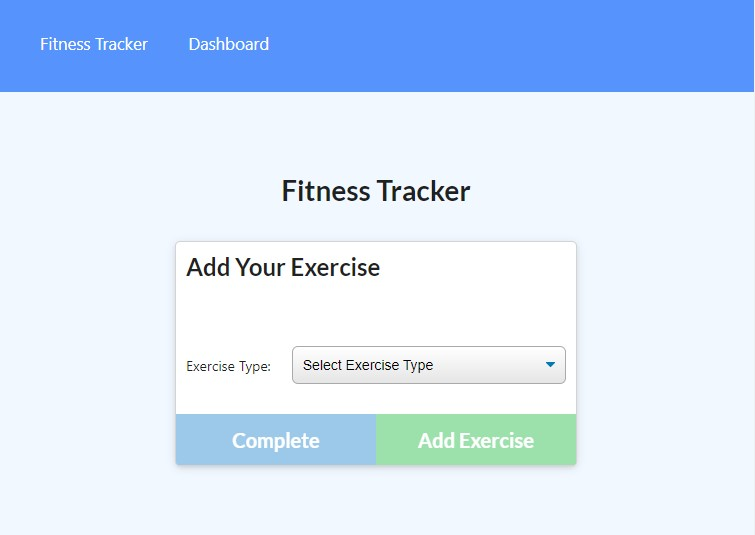

# Title: Workout Tracker

## Descrption:

The application allows you to track your daily workouts. You are able to input either resistance or cardio workouts.

## Table of Contents:

- [Installation](#installation)

- [Usage](#usage)

- [License](#license)

- [Contributing](#contributing)

- [Tests](#tests)

- [Questions](#questions)

## Installation

Application is deployed to https://damp-lowlands-21335.herokuapp.com/exercise?id=60d8c9d3a9bee500152b1be5

## Usage

Users can access the site and use the dropdown menu to enter in the type of workout. Then they can enter in additional information about their workout including things like name, duration, weight, reps and sets. Additional exercises can be added to the workout using the "add exercise" button and you can finish the workout by clicking on "Complete". Users can view totaled information about their workouts by clicking on the "Dashboard" link.

## License

This application is covered by the MIT license. Click the link for more information.

[https://opensource.org/licenses/MIT](https://opensource.org/licenses/MIT)

## Contributing

Mark Raudenbush

## Tests

minimal testing performed.

## Questions

You can access my GitHub profile throught the following link.
[My GitHub](https://github.com/markraud)

Link to the Workout Tracker GitHub repo:
[Workout Tracker](https://github.com/markraud/workout_tracker)

Please email with any questions.
[markraud@hotmail.com](mailto:markraud@hotmail.com)
